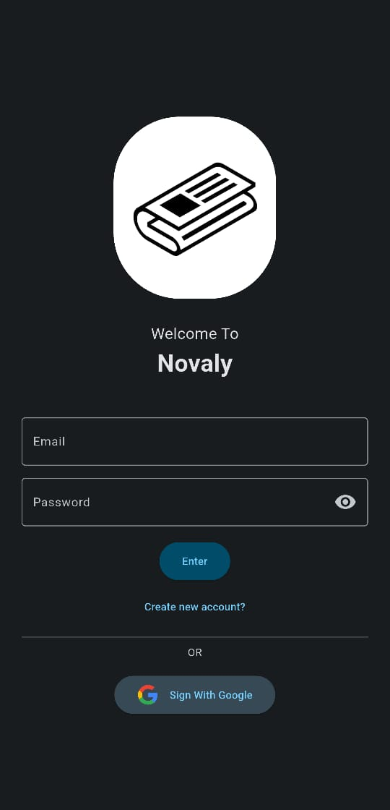
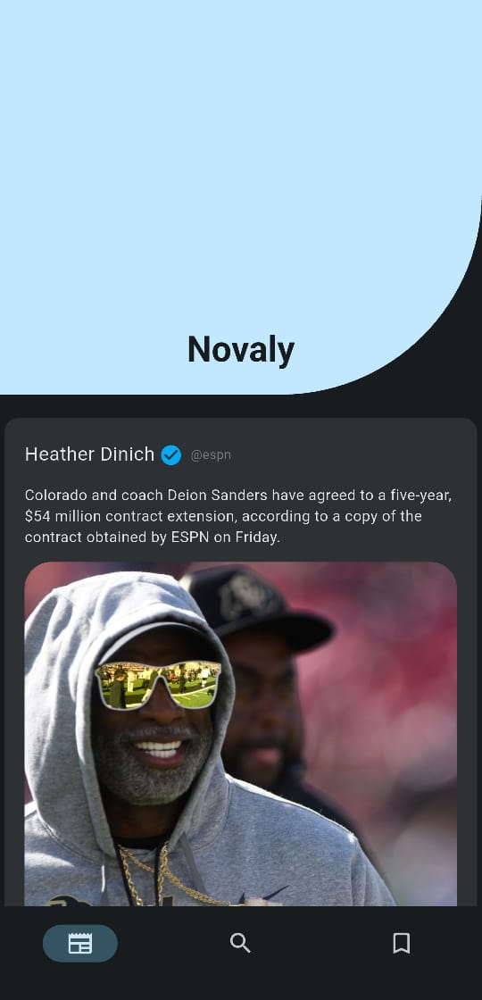
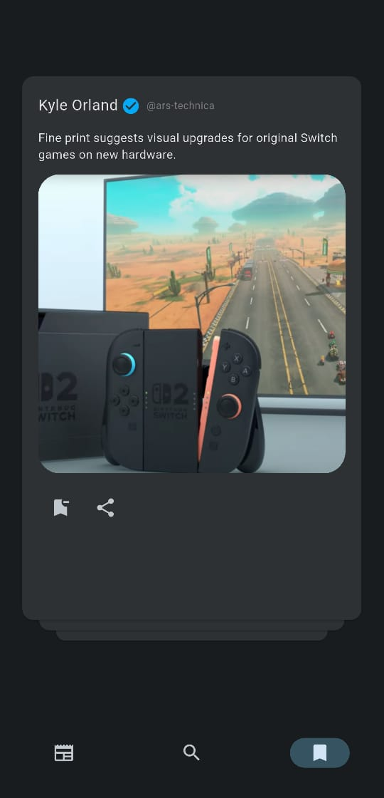

# Novaly

Novaly ("Nova" means "new" in Latin) is a modern and responsive Flutter news app that delivers the latest headlines and allows users to search for and bookmark articles seamlessly.

The app is designed with a clean UI and optimized for performance using Riverpod for state management.

## Architecture

Novaly follows the **MVC (Model-View-Controller)** architectural pattern:

- **Model**: Contains the `Article` model, representing articles fetched from the API.
- **View**: Includes the main screens (Home, Search, Bookmark, SignIn) and a `widgets` folder that contains the `ArticleWidget`.
- **Controller**: Handles API calls using **Dio**, manages authentication with **Firebase Auth**, and manages state with **Riverpod**.

## Features

### Home Screen

- Displays headline articles in a structured X-post layout.
- Uses a **SliverAppBar** containing the app name.
- **SliverList** displays the articles with a keep-alive feature to reduce excessive API calls.
- A **scroll-up button** appears when the user scrolls down, allowing easy navigation back to the top.
- **Logout button** in the app bar if the user is signed in.
- Displays **user name and profile image** if signed in with Google.

### Search Screen

- Similar to the Home Screen but includes a search bar in the **SliverAppBar**.
- Allows users to search for articles dynamically.
- Displays search results using **SliverList**.
- A **scroll-up button** appears when scrolling down for quick access to the top.

### Bookmark Screen

- Displays saved articles in a Tinder card-like swipeable layout.
- Articles can be bookmarked from any screen.
- **Bookmarked articles are saved in Firestore**, allowing user-specific bookmarks based on their email.

### Sign Screen

- Allows users to **sign in and sign up** using email and password.
- Supports **Google Sign-In** for authentication.
- Once signed in, the user's email is used to fetch their bookmarked articles from Firestore.

### Article Widget

- Displays the article **author**, **source**, **description**, and **image**.
- Includes a **bookmark button** to save articles.
- Includes a **share button** to share the article description and link to any app.

### Navigation

- Uses **PageView** for smooth page transitions.
- Integrated **BottomNavigationBar** to switch between Home, Search, and Bookmark screens seamlessly.

### Data Fetching

- Uses **Dio** to fetch news data from [NewsAPI.org](https://newsapi.org/).
- Optimized API calls to reduce redundant requests and improve performance.
- **Firestore** is used to store and load bookmarks for each user.

### Additional Features

- **Firebase Authentication** for user sign-in and sign-up.
- **Firestore** for storing and loading user bookmarks.
- **Native splash screen** for a seamless startup experience.
- **System color adaptation** using dynamic theming.
- **Responsive UI** for different screen sizes.
- **Environment variables** managed securely with `flutter_dotenv`.

## Tech Stack & Packages

```yaml
# UI and Theming
cupertino_icons: ^1.0.8
dynamic_color: ^1.7.0
flutter_screenutil: ^5.9.3

# State Management
flutter_riverpod: ^2.6.1

# API and Network
dio: ^5.8.0+1
flutter_dotenv: ^5.2.1

# Navigation & User Interaction
url_launcher: ^6.3.1
share_plus: ^10.1.4
flutter_card_swiper: ^7.0.2

# Splash Screen
flutter_native_splash: ^2.4.5

#FireBase Auth/Store
firebase_core: ^3.12.1
firebase_auth: ^5.5.1
cloud_firestore: ^5.6.6
google_sign_in: ^6.3.0
```

## Installation

1. Clone the repository:
   ```sh
   git clone https://github.com/yourusername/novaly.git
   ```
2. Navigate to the project directory:
   ```sh
   cd novaly
   ```
3. Install dependencies:
   ```sh
   flutter pub get
   ```
4. Create a `.env` file in the `lib` folder and add your API key:
   ```env
   NewsApi=your_key
   ```
5. Set up Firebase:

   - Follow [Firebase Setup Guide](https://firebase.google.com/docs/flutter/setup) to add Firebase to your Flutter app.
   - Enable Firestore and Firebase Authentication.

6. Generate the native splash screen:

   ```sh
   flutter pub run flutter_native_splash:create --path=native_splash.yaml
   ```

7. Run the app:
   ```sh
   flutter run
   ```

### App Screens

| Sign Screen                          | Home Screen                          | Search Screen                            | BookMark Screen                              |
| ------------------------------------ | ------------------------------------ | ---------------------------------------- | -------------------------------------------- |
|  |  |  |  |

## Contributions

Feel free to fork the repository and submit pull requests for improvements.
